<div align="center">

# OSSC — Octatrack Stem Slice Creator

**Turn a finished song into a playable Elektron Octatrack project.**
Drop in your stems and an arrangement MIDI; get back sliced sample chains, `.ot` slice grids,
and pattern-programmed banks — ready to perform.

### ▶ [**Open the app**](https://xuio.github.io/octatrack-exporter/) · runs entirely in your browser, nothing is uploaded · installable, works offline

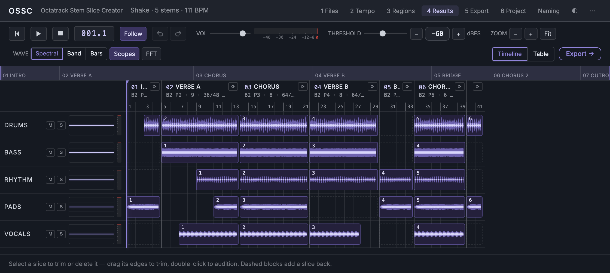

</div>

---

## The paradigm

A finished track is frozen. The Octatrack can take it apart again — but only if the song arrives
in the shape the machine thinks in: **audio tracks, patterns, slices, and trigs**. OSSC performs
exactly that translation, and nothing else.

The whole tool rests on one mapping:

| In your song | On the Octatrack |
| --- | --- |
| A stem (drums, bass, pads…) | One **audio track** with one Static sample slot |
| An arrangement section (intro, verse, chorus…) | One **pattern**, numbered from Bank 2 |
| What a stem plays *during* one section | One **slice** inside that track's sample chain |
| The moment a section begins | One **sample trig**, on the step matching that bar |

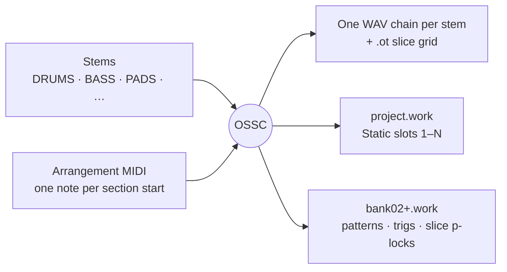

**Why chains instead of one file per section.** An Octatrack track plays one sample at a time.
So each stem becomes a *single* WAV holding that stem's every section back to back, and the slice
grid marks where each section starts. A trig with a `STRT` parameter lock says *which* section to
play. Five stems across seven sections is therefore five files — not thirty-five — and pattern 3
simply trigs slice 3 on every track at once.

**Why everything snaps to bars.** Trigs live on a step grid, so a slice has to begin on a bar or
the trig can't land on it. Section length picks the pattern scale, and the scale decides how many
trig keys one bar is worth:

| Section length | Scale (TEMPO MULTIPLIER) | Trig keys per bar |
| --- | --- | --- |
| ≤ 4 bars | 1x | 16 |
| ≤ 8 bars | 1/2x | 8 |
| ≤ 16 bars | 1/4x | 4 |
| ≤ 32 bars | 1/8x | 2 |

A section beginning on bar 5 of a 1/4× pattern therefore trigs on step 17. Patterns run in **PER
TRACK** scale mode with **MASTER LENGTH = INF**, so each track loops on its own length and you
change sections when *you* decide to.

**Silence is information.** If a stem plays nothing during a section it gets no slice, so that
pattern has no trig for it and the track simply stays quiet. Your arrangement's dynamics survive
the translation for free — that is what the loudness threshold on the timeline is deciding.

**What you get back** is not a rendering of your song. It is your song as material: reorder the
sections, loop the chorus, drop the drums, morph a scene, and the audio is still the mix you
bounced — sample-for-sample, at the level you left it.

#### Limits worth knowing up front

- 8 audio tracks → up to 8 stems.
- 64 slices per sample → up to 64 sections.
- Sections longer than 32 bars can't be one pattern; split them in the MIDI.
- Patterns are written from **Bank 2** onward. Bank 1 is left alone for your own intro.

---

## Tutorial

### What you need

- **Stems** — 5–6 stereo files, all starting at bar 1 and all the same length. **WAV**, **AIFF**
  (including AIFC `sowt`/`fl32`) and **FLAC** are all read; 44.1 kHz 16/24-bit WAV is copied
  untouched, anything else is converted. Drop loose files, a folder, or a `.zip`.
- **An arrangement MIDI** — one note at each section start, plus one final note marking the end of
  the song. Seven sections means eight notes. Nothing else in the file matters.
- Optionally, **a project folder saved from your Octatrack**, if you want OSSC to build the whole
  project for you.

> No files to hand? Click **Shake · 111** on the first screen — a complete demo song is synthesized
> in your browser and runs through the identical pipeline.

### 1 · Load the stems

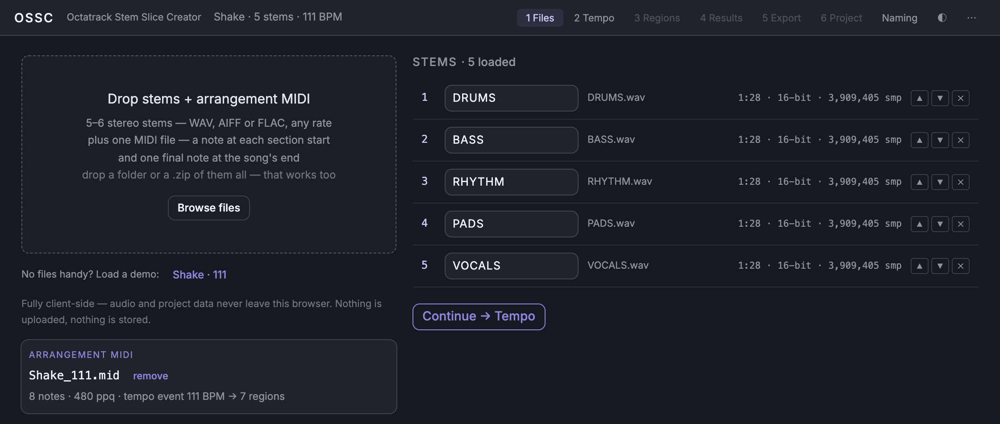

Drag your files anywhere onto the pane. Each stem becomes a row; the order here becomes the
Octatrack **track order**, so drag them into the order you want with the ▲▼ buttons. Rename a stem
by typing in its field — that name ends up in the exported file names.

### 2 · Confirm the tempo

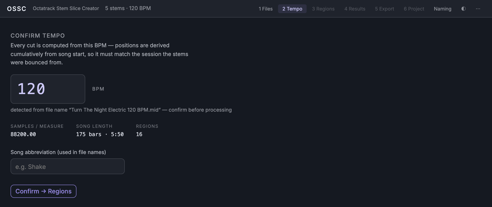

Every cut is derived from this BPM, cumulatively from the start of the song, so it has to match the
session the stems came from. OSSC guesses from the MIDI file name, then from a tempo event.

### 3 · Check the sections

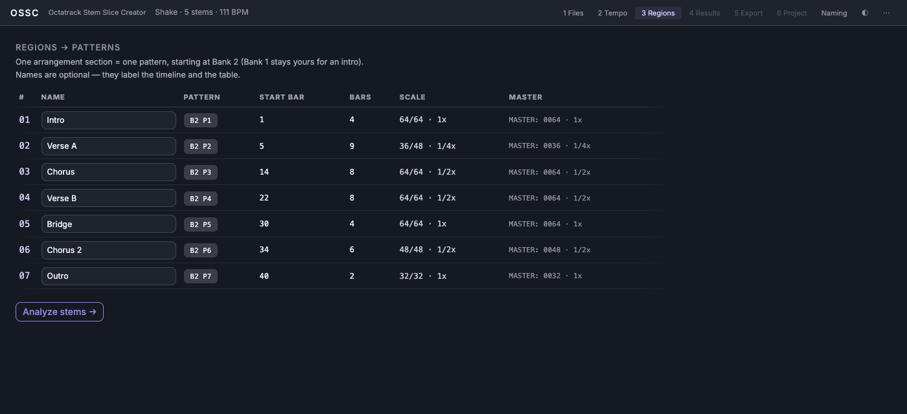

Each MIDI note pair becomes a section, and each section is assigned its pattern (`B2 P1`, `B2 P2`,
…) and its scale. Name them if you like — the names follow through to the timeline, the printable
sheet and the pattern table. Then hit **Analyze stems**.

### 4 · Shape the slices

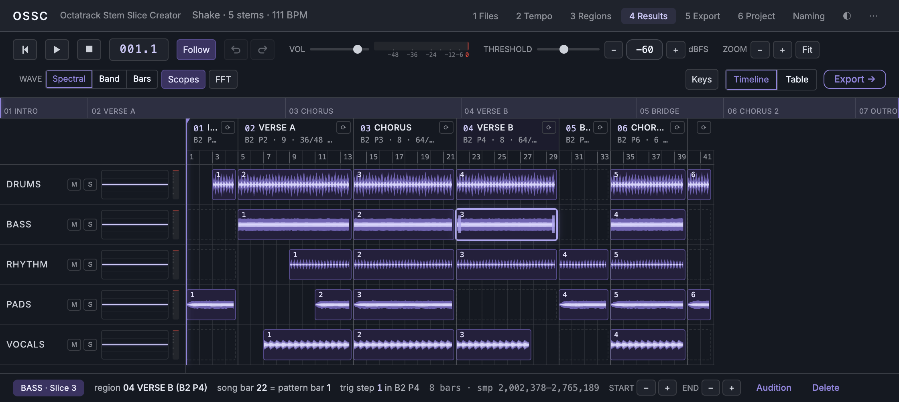

This is where the work happens. OSSC has already trimmed each section down to where that stem is
actually audible; everything else is you refining it:

| | |
| --- | --- |
| **Threshold** | Raise it to drop quiet tails, lower it to keep them. Every slice re-trims live. |
| **Drag a slice edge** | Trim it, quantized to bars. Drag past a section boundary and the overhang becomes its **own clip in the next section** — the same shape the import would have made. |
| **Fine trim** | Open it from the selection bar: move a slice edge by *samples* on a zoomed strip of the boundary, or snap it to the nearest **zero crossing** so the slice can't click on the device. Moves the slice point only — the audio is untouched, and the offset survives later bar-level drags. |
| **Delete / dashed blocks** | Remove a slice, or click the dashed placeholder to bring one back. |
| **⌘Z / ⇧⌘Z** | Undo and redo — one entry per drag, and it covers renames, reorders and the threshold too, not just clip edits. |
| **Double-click** | Rename a track or a section right in the timeline. Double-click a section in the *overview strip* to zoom the timeline onto it. |
| **Space** | Play / **pause** — pausing freezes at the audible position and play resumes exactly there, even inside a loop. Home stops back to bar 1. |
| **⟳ on a section** | Loop it. The transport then shows the device's view — `B2 P3 · 1/2x · step 12/32`, live — with ◀ ▶ to move the loop across patterns while it plays. Releasing a loop keeps playing rather than stopping. |
| **⇧-drag in the ruler** | Loop any bar range — the brace is drawn in the ruler for range and section loops alike. |
| **Drag the ⋮⋮ grip** | Reorder tracks right in the timeline rail (this is the Octatrack track order). Analysis, edits and playback all survive the move. |
| **Pinch / ⌘-scroll** | Zoom; waveform detail grows as you go in. |

The whole editor is reachable from the keyboard — press **?** (or the **Keys** button) for the full
list. Arrows walk the grid of tracks × sections, **⇧←/→** and **⌥←/→** move the selected clip's
start and end a bar at a time, and **, . &lt; &gt;** nudge its edges by a millisecond (**z** snaps both
to zero crossings) — bar-exact and click-free edits without a steady hand.

Everything you change is audible immediately — trims, deletes, undo and threshold moves all re-cue
the transport where it is playing.

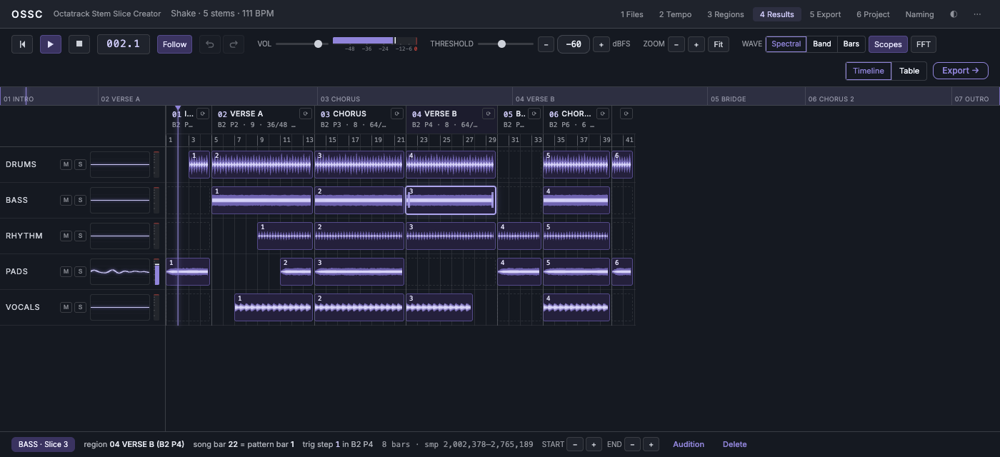

Per-track meters are dBFS with a red zone above −3 dB and a hard line at 0; the scopes and spectrum
analyzers are there to check what a slice actually contains. The **VOL** slider is monitoring only —
it never touches the exported audio. The playhead is corrected for output latency, so it tracks what
you *hear* rather than what has been handed to the audio device — on Bluetooth that is the difference
between the marker leading the sound by a beat and it being in step.

Edits are saved as you go. Reload the page, drop the same stems back in, and OSSC offers to put your
trims, names and tempo back — along with the view itself: zoom, scroll, the selected clip, the loop
and the start bar land where you left them. The audio is too large to keep, but the work is not.

OSSC is also an installable PWA: once loaded, it works fully offline — everything runs client-side
anyway, so a studio without internet changes nothing.

Switch to **Table** for the pattern map: which slice each track trigs in each pattern, and on which
step.

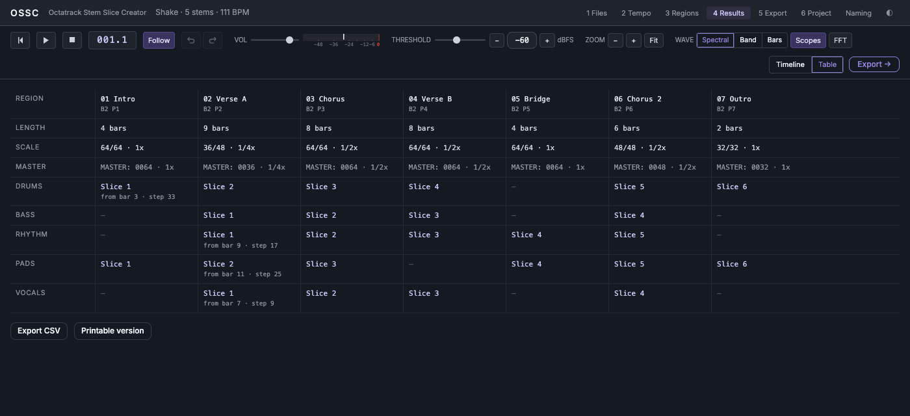

### 5 · Export the stems

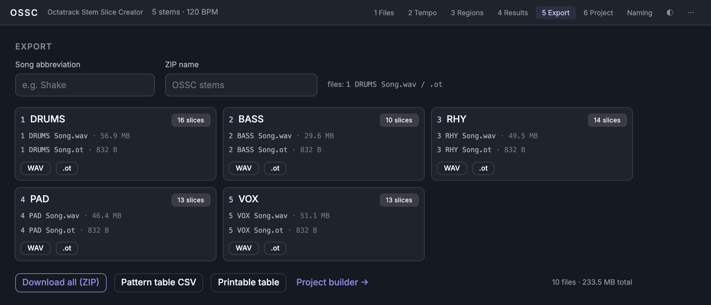

Each stem becomes a `.wav` chain plus an 832-byte `.ot` sidecar carrying its slice grid. Download
them individually or as one ZIP — name it whatever you like (naming is reachable from the header on
every step). This alone is enough if you prefer to assign the slots on the device yourself.

### 6 · Or let OSSC build the whole project

Drop a project folder saved from your Octatrack — or a `.zip` of one — onto the **Project** step,
and you get back a complete copy under a name of your choosing:

- stem WAVs and `.ot` files placed **inside the project folder**
- `project.work` — Static slots 1–N assigned, project tempo set, timestretch off, gain at unity
- `markers.work` — trim and slice grid per slot, so slices show up without reloading samples
- `bank02+.work` — one sample trig per stem per section, with the slice p-locked via `STRT`, the
  per-track scale set **on the stem tracks only**, and `MASTER LENGTH = INF`. Tracks OSSC did not
  fill — one you keep for remixing at its own bar length, and the master track 8 — keep whatever
  scale they already had.
- `PATTERNS.html` — a printable sheet of everything that was written

**Your parts and scenes are never rewritten.** Bank offsets are verified against your own file
before a byte is written, and the part region — where scenes live — is checked byte-identical
afterwards. On any mismatch that bank is copied through untouched and the sheet tells you so.

**Delivery is your choice.** Download the result as a `.zip`, or — in Chrome and Edge — click
**Write to folder…** and OSSC writes the project straight onto the mounted CF card via the File
System Access API: no zip, no extracting, no wrong-folder mistakes. After a direct write it reads
every file back **off the disk** and re-runs the full verification on what is actually there, so
the report can honestly say *"Verified on disk"*.

**Everything written is then read back.** Once the files are assembled, OSSC decodes them again —
every trig, the slice each one fires, the per-track scales, both slice grids, the gains and all the
checksums — and diffs that against the pattern table on screen. The result is rendered, not just
prose: a green banner with the counts, and a collapsible table decoded **back out of the written
bank bytes** — step → slice chips per pattern per track, mismatches in red.

The same decoder powers **Inspect programmed patterns**: drop any previously exported project on
the Project step and see exactly what is programmed in its banks and slice grids, before touching
anything.

The readback pass proves the writers did what this build intended, which is where every format bug
in this project's history had actually been: a slice number stored at the wrong scale, a trig mask
byte in the wrong half-page, the recorder's +12 dB gain default. All three would have failed this
check before reaching a CF card, and each one is now a test case in
[`tests/readback.test.js`](tests/readback.test.js). And the format itself is no longer only
reasoning: the full export path — unity gain, slice numbers, trig placement, per-track scales with
MASTER INF — **has been verified on an Octatrack running OS 1.40**.

**One step remains on the device:** on each used track, assign a **STATIC** machine and set its
default sample (**TRK DEFAULT**) to the matching slot. Trigs carry no sample locks, so that is all
it takes. Then hit play on `B2 P1`.

---

## Themes

Seven schemes, generated from OKLCH ramps so contrast holds up in every one.

| Cobalt | Ember | Paper |
| --- | --- | --- |
| 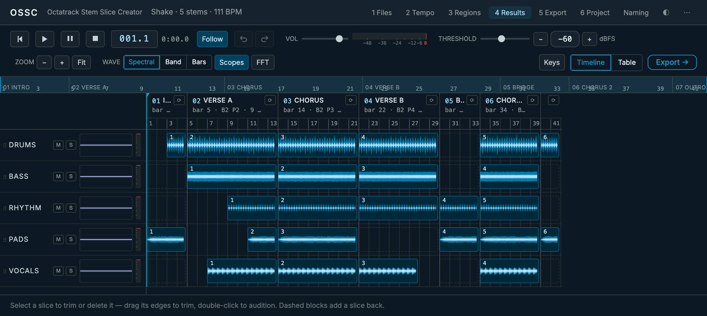 | 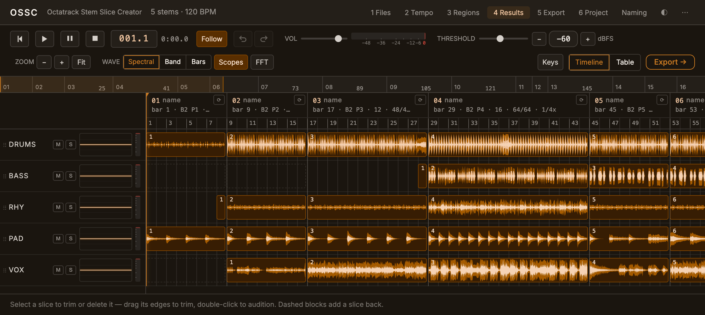 | 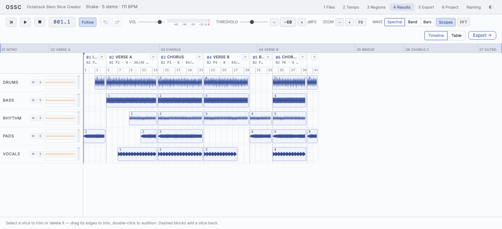 |

---

## Audio integrity

OSSC never changes level. Stems that are already 44.1 kHz stereo 16/24-bit WAV are copied
**byte-for-byte** into the exported chain — no normalization, gain staging, dithering or
compression anywhere in the path. Conversion happens only for what the Octatrack cannot load
(other sample rates, mono, 32-bit float, AIFF, FLAC), and is a straight format conversion. A
16-bit source stays 16-bit rather than being padded to 24.

Sample-rate conversion uses a Kaiser-windowed sinc kernel, not polynomial interpolation. That
matters when *downsampling* — the everyday 48 → 44.1 kHz case — because interpolation on its own
does nothing about content above the new Nyquist, so it folds back into the top of the band as an
audible artefact. Measured on the current kernel: flat to 18 kHz, −0.2 dB at 19 kHz, and a 23 kHz
tone that would otherwise mirror down to 21 kHz comes out **87 dB down**. Every output sample is
normalized by its own tap-weight sum, which pins DC gain at exactly 1.0.

Every gain the device reads is unity, so the sample's ATTRIBUTES page shows **GAIN +0.0 dB**:
`GAIN=48` on each Static slot and gain `48` (a `u16` at offset 43) in the `.ot` sidecar — 48 being
the 0 dB point of the 0–96 = −24…+24 dB range — with timestretch off so nothing is resampled on
playback.

[`tests/audio-integrity.test.js`](tests/audio-integrity.test.js) asserts all of it, including
sample-exact equality between source and export.

---

## Development

```bash
npm install
npm run dev        # dev server
npm run lint       # ESLint, incl. the react-hooks rules
npm run types      # tsc --checkJs over the pure core
npm test           # core tests (node --test, no browser needed)
npm run check      # lint + types + tests
npm run build      # production build → dist/
```

Linting is not decoration here: `react-hooks/rules-of-hooks` and
`exhaustive-deps` catch precisely the class of bug this codebase has actually
hit — stale closures reading state before it flushed, and effects missing a
dependency. CI runs `--max-warnings 0`, so a new warning fails the build.
`npm run types` runs TypeScript over `src/lib`, `src/export` and the audio
engine with `checkJs`: this domain is all bar indices, sample offsets and byte
offsets, and they are all just numbers until something checks them.

Pushing to `main` lints, tests, builds, and deploys to GitHub Pages
([`.github/workflows/pages.yml`](.github/workflows/pages.yml)).
The README screenshots are regenerated with `node scripts/screenshots.mjs` against a running
`npm run preview`; `node scripts/perf.mjs` measures the app at its ceiling (the built-in
**Stress · 8×64** demo: 8 stems × 64 sections, 457 clips) — scroll frame times, long tasks,
zoom/edit/undo latency — and `scripts/icons.mjs` regenerates the PWA icons from `public/icon.svg`.

Performance at that ceiling is paint-bound, not JS-bound: zero long tasks during a full-song
scroll and 120 fps playback with scopes on (at 1× CPU). The numbers that justified — or ruled
out — each optimization are recorded in the code next to what they measured.

### Project structure

The core (`src/lib`) is pure and DOM-free, so every format rule is unit-testable
in Node. Above it sit three thin layers: hooks that own one concern each, small
presentational components, and an audio engine that knows only samples.

```
src/
  App.jsx                  composition: wires the hooks to the six steps
  main.jsx                 entry point

  lib/                     pure core — no DOM, no React, fully tested
    constants.js             sample rate + tempo math
    pcm.js                   band-limited resampling + PCM packing
    wav.js  aiff.js  midi.js format parsing
    analysis.js              per-measure peaks, silence trim, waveform data
    slices.js                slice building, manual + fine trims, boundary splitting
    zerocross.js             zero-crossing search for click-free slice points
    otFile.js  bankFile.js  markersFile.js  projectFile.js   device writers
    readback.js              device-file readers + the export verifier
    transport.js  timelineView.js   pure transport / view math
    zip.js  unzip.js  dnd.js  meters.js  demo.js

  audio/
    AudioEngine.js           Web Audio graph + scheduling, in samples only
    decodeFlac.js            FLAC via the browser decoder, at the file's own rate
    visualizers.js           canvas drawing for meters, scopes, spectrum

  waveform/WaveformCache.js  bar-anchored waveform cache

  export/                   "save something to disk", as pure functions
    naming.js  stemFiles.js  patternSheet.js  patternDecode.js
    projectBuild.js  dirWrite.js  download.js

  state/                    one hook per concern
    usePrefs  useThemeColors  useAnimationFrame
    useStems  useMixer  useAnalysis  useSliceEdits  useHistory
    useTransport  usePlayhead  useTimelineView  useTimelineGestures  useTimelineKeys
    useFileDrop  useProjectFolder  useDragResize  useExports  useSession

  components/
    header/    Header, NamingPanel, ThemePicker
    steps/     FilesStep, TempoStep, RegionsStep, ResultsStep, ExportStep, ProjectStep
    timeline/  Transport, Overview, Ruler, RegionHeader, TrackRail, Lane,
               SliceBlock, Playhead, SelectionBar, FineTrim, PatternTable
    project/   VerifyPanel, PatternTable (decoded), InspectPanel
    ui/        EditableLabel, Field, LevelMeter, Oscilloscope, DropZone,
               DropOverlay, Notices, ShortcutsPanel

  public/                  PWA: manifest, icons, hand-rolled service worker

  styles/                  design tokens, themes, app styles

tests/                     node --test suite for the core
docs/                      format notes, spec, README images
scripts/screenshots.mjs    regenerates the README images by driving the real app
```

Two decisions worth knowing when reading it:

- **Slices are derived, never stored.** The analysis produces the measure grid
  and per-stem peaks; slice positions come out of a `useMemo` over
  `(analysis, threshold, edits)`. Change any one of them and the timeline, the
  exports and the audio engine all follow from the same recomputation.
- **The engine is told, not asked.** `AudioEngine` takes a program (which slices
  each track plays) and re-cues itself in place when that program changes, which
  is what makes an edit audible the moment you make it.
- **Undo is a stack of inverse commands, not snapshots.** Clip edits, names and
  the threshold each live in their own state, and `useHistory` records how to
  reverse a change — which is what lets one ⌘Z span all of them without hoisting
  everything into a single store.

---

## File formats, credits & caveats

Binary layouts for `bank??.work` and `markers.work` are based on format **facts** documented by
[ot-tools-io](https://gitlab.com/ot-tools/ot-tools) (GPL v3 — no code ported), and the `.ot` layout
on [OctaChainer](https://github.com/KaiDrange/OctaChainer). Several details were corrected through
on-device verification and are recorded in [`docs/notes-formats.md`](docs/notes-formats.md) — most
importantly the trig-mask byte order (the published note is wrong for pages 2–4) and the fact that
the slice p-lock stores a 0–127 `STRT` knob value at two ticks per slice.

Verified against **Octatrack OS 1.40** (bank data version 23, markers version 4) only — both in
bytes and in practice: generated projects have been loaded and played back correctly on the device.
The writers refuse to touch files whose structure doesn't match, and every generated project is
read back and diffed against its own pattern table before it reaches your card. Still: keep a
backup of your CF card, and give any new OS version a test project before trusting it with a gig —
a format bump changes the data version, and the writers will (deliberately) refuse it until
re-verified.

Not affiliated with Elektron. Octatrack is a trademark of Elektron Music Machines.
